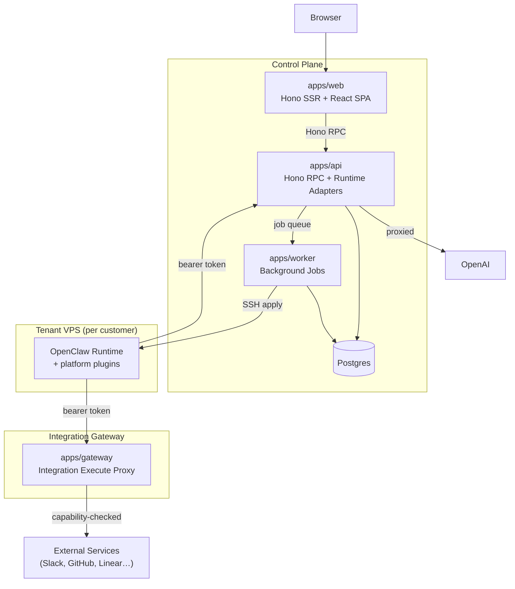

A managed control plane for [OpenClaw](https://github.com/openclaw/openclaw) agent runtimes. Customers get a fully-managed AI agent they can connect to Slack, WhatsApp, and other channels — the operator handles all infrastructure, updates, security, and integrity; customers just use it.

- Zero ops for customers — no runtime maintenance, no updates to manage
- One control plane, many tenant runtimes — push config changes fleet-wide
- Security via proxying — API keys and LLM calls never touch tenant servers
- Agent self-modification — the agent can change its own config and skills via tool calls or the web UI

## Architecture



The system has three planes. The **control plane** (`apps/api`, `apps/web`, `apps/worker`, Postgres) is the authoritative system — it manages tenants, owns all state, and serves the workspace UI. The **integration gateway** (`apps/gateway`) is an isolated proxy that routes agent tool calls to external services, enforcing capability policy set by the control plane. **Tenant runtimes** are OpenClaw instances running on provisioned VPS servers, extended with platform-specific plugins; they hold only a short-lived bearer token and make all outbound calls through the control plane.

**Key flows:**
- **Provisioning:** Worker creates a Hetzner VPS, installs the custom runtime image, and applies managed config via SSH
- **Config apply:** Control plane generates `openclaw.json` + skill files, SSH-pushes to the tenant server, runtime restarts with new state
- **Integration tool calls:** Runtime → Gateway (bearer auth) → capability policy check → external service → result
- **AI calls:** Runtime → ai-provider plugin → Control plane API → OpenAI (proxied; runtime never holds OpenAI keys)
- **Self-modification:** Agent calls managed-config or managed-skills tools → control plane state updated → projected on next apply

## Design Highlights

1. **Control plane as source of truth** — The control plane holds an authoritative snapshot of every tenant's config, installed skills, and runtime files. The tenant VPS is ephemeral; each apply cycle projects desired state onto it.

2. **Integration gateway as capability firewall** — All integration commands are proxied through an isolated gateway service. The control plane determines which commands each integration exposes to the agent; the runtime cannot invoke anything outside that policy.

3. **LLM calls proxied, not delegated** — The tenant runtime holds only a short-lived bearer token. All OpenAI calls are proxied through the control plane's API, which holds credentials and applies usage metering. The runtime never sees a raw API key.

4. **Agent self-modification at runtime and via UI** — The agent can install skills, modify its own prompt, and configure integrations via tool calls. The same mutations are available from the workspace UI. Both paths write through the same control plane state and are projected on the next apply.

5. **Fleet-wide updates** — Because all runtime config originates from the control plane, updating a model, adding a default skill, or changing system behavior for all tenants is a control-plane change followed by an apply cycle — no per-tenant manual work.

## Repository Layout

```
apps/
  web/      — Hono SSR + React SPA: workspace UI (sessions, files, integrations, skills, billing, settings)
  api/      — Control plane API: Hono RPC for web, webhooks, OAuth, and runtime HTTP adapters
  gateway/  — Integration execute gateway: isolated proxy for agent tool calls
  worker/   — Background job processor: VPS provisioning, config apply, sync, billing

packages/features/
  runtime-core/          — Runtime substrate: managed config, skills, file snapshots, session handling
  integrations-runtime/  — Integration framework: Slack, Linear, GitHub, PostHog, Brave, Gandi
  workspace-core/        — Workspace bootstrap, settings, and usage contracts
  workspace-chat/        — Team workspace chat events and contracts
  workspace-members/     — Member directory, invitations, and roles
  workspace-onboarding/  — First-run provisioning flow
  platform/              — Platform admin schemas: org list, tenant status, jobs, usage
  billing/               — Usage metering, credit ledger, Stripe integration

runtime-plugins/
  otto-ai-provider/       — OpenAI proxy provider: LLM calls routed through control plane
  otto-integrations/      — Integration command execution from runtime
  otto-managed-skills/    — Skill install/remove/create tools for the agent
  otto-managed-config/    — Instruction file management tools
  otto-session-reporter/  — Session lifecycle and transcript reporting
  otto-workspace-chat/    — Workspace chat channel access from runtime
  otto-web-provider/      — Web search provider proxy

runtime-image/
  Dockerfile              — Extends upstream OpenClaw image with all platform plugins
```

## Tech Stack

| Component | Choice |
|---|---|
| Runtime | Bun |
| APIs | Hono (type-safe RPC) |
| Frontend | React 19 + TanStack Router/Query + shadcn/ui + Tailwind |
| Database | Postgres + Drizzle ORM |
| Agent runtime | OpenClaw (extended via plugins) |
| Cloud / VPS | Hetzner |
| Auth | WorkOS |
| Billing | Stripe |
| Analytics | PostHog |

## Getting Started

1. Install dependencies
```bash
bun install
```

2. Create your env file
```bash
cp .env.example .env
```

3. Start Postgres
```bash
docker compose -f docker-compose.yml up -d
```

4. Run migrations
```bash
bun run db:migrate
```

5. Start the services
```bash
bun run dev:all
```

Default local services:
- `apps/web`: `http://localhost:3000`
- `apps/api`: `http://localhost:3002`
- `apps/gateway`: `http://localhost:3001`

## Common Commands

```bash
bun run build:web
bun run build:api
bun run build:worker
bun run build:gateway

bun run test:web
bun run test:api
bun run test:worker
bun run test:gateway
```

## Environment

- [`.env.example`](.env.example) — local development
- [`.env.production.example`](.env.production.example) — production shape
